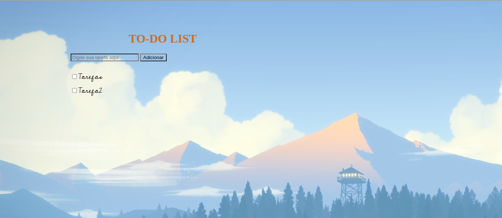

## Objetivo
Fazer uma lista de tarefas utilizando html e javascript proposto como desafio no curso Introdução ao Javascript do bootcamp MRV FullStack na DIO.

## Como executar
* Clonar o projeto para a máquina local;
* Um navegador atualizado

## Resultado
